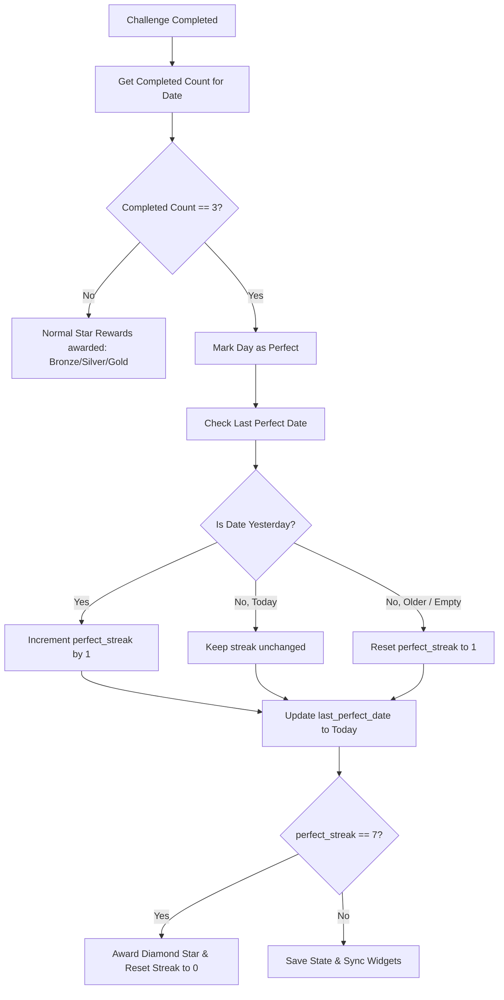

# Weekly Themes & Perfect Week Streaks (Diamond Stars)

This document provides a comprehensive, production-grade specification for the **Weekly Themes & Perfect Week Streaks** system. It describes the complete data models, mathematical rotations, state persistence, state transitions, UI/UX layouts, and particle effect mechanics for the "Diamond Sparkle" swipe trail.

---

## 1. Feature Philosophy & Objectives
- **Long-term Retention**: Give players a long-term goal (Perfect Weeks) that transcends the daily 1-day check-in.
- **Cognitive Cohesion (Weekly Themes)**: Grouping challenges under a weekly modifier theme allows players to build strategies and get accustomed to specific mechanics (e.g., visual distortions in Glitch Week, spatial alterations in Mirror Week) over a 7-day period, rather than suffering mental whiplash from daily theme switching.
- **Premium Cosmetics**: Introduce high-value cosmetic rewards (Diamond Sparkle Trail) that cannot be unlocked with normal level-clears, demonstrating puzzle mastery.

---

## 2. Technical Architecture & Data Rotation Math

### A. Weekly Theme Modifier Lock
The app currently has a 30-day challenge database (`_kDailyChallengesPlan` in `daily_challenge_manager.dart`). Under the weekly theme system:
1. **The Challenge Selection (Daily Rotation)**: The specific games, level indexes, and base difficulty configurations still rotate every calendar day. This maintains fresh daily variety.
2. **The Theme & Modifier Override (Weekly Lock)**: The active `modifierType`, `modifierName`, `modifierDescription`, and `extraParams` are locked for 7 progress days. 
3. **Rotation Math**:
   - Let `currentDay` be the active progress day (1 to 30) returned by `DailyChallengeManager.getActiveDay()`.
   - The active **Week Index** (0-based) is computed as:
     $$\text{weekIndex} = \lfloor\frac{\text{currentDay} - 1}{7}\rfloor$$
   - The **Theme Day** (the day from `_kDailyChallengesPlan` from which the theme/modifier details are pulled) is computed as:
     $$\text{themeDay} = (\text{weekIndex} \times 7) + 1$$
     *Note: Since the list has 30 days, Week 5 (Days 29 and 30) will fallback/wrap using a modulo.*
   - **Theme Grouping Mapping**:
     - **Week 1 (Days 1–7)**: *Fog Theme* (Modifier: `fog`). Focuses on local visibility spotlights.
     - **Week 2 (Days 8–14)**: *Illusion & Time Theme* (Modifier: `zoom` / `time_warp`). Focuses on scale and pacing.
     - **Week 3 (Days 15–21)**: *Gravity & Physics Theme* (Modifier: `gravity`). Focuses on falling tiles and layout shifting.
     - **Week 4 (Days 22–28)**: *Glitch & Chaos Theme* (Modifier: `glitch` / `chaos`). Focuses on high-distortion, unexpected board changes.
     - **Week 5 (Days 29–30)**: *Grand Finale Theme* (Modifier: `grand_finale`).

---

## 3. Persistence Schema (`SharedPreferences`)

To ensure offline functionality and avoid progress loss, the following local keys will be registered:

| SharedPreferences Key | Type | Description |
|---|---|---|
| `daily_v2_perfect_streak` | `int` | The count of consecutive days where all 3 challenges were fully cleared. Range: `0` to `7`. |
| `daily_v2_last_perfect_date` | `String` | ISO 8601 Date String (`YYYY-MM-DD`) representing the last date a perfect day (3/3) was cleared. |
| `daily_diamond_stars` | `int` | The total number of earned Diamond Stars. |
| `daily_perfect_week_history` | `List<String>` | List of dates representing completed perfect days in the current week window (used for rendering the UI checklist). |

---

## 4. State Transition & Streak Validation Rules

### A. Completion Flowchart



### B. Handling Edge Cases
1. **Missed Days**:
   - If the player completes all 3 challenges on Monday, misses Tuesday, and completes all 3 on Wednesday:
     - On Wednesday, the system detects `last_perfect_date` is Monday (2 days ago).
     - The streak `daily_v2_perfect_streak` resets to `1`.
2. **Timezone Shifts**:
   - All dates are evaluated in Coordinated Universal Time (UTC) to prevent timezone manipulation (e.g., altering device time backwards to salvage a broken streak).
3. **Double Completion Attempts**:
   - Tapping or re-playing a completed challenge does not trigger streak logic updates.

---

## 5. UI/UX Design Specifications

### A. The Daily Screen Update
The daily screen (`daily_screen.dart`) will be augmented with a specialized theme header card:
- **Weekly Theme Header**:
  - Displays a custom-colored gradient banner matching the active weekly theme (e.g., Fog Week gets a deep charcoal-to-slate gradient; Gravity Week gets a dark indigo-to-purple gradient).
  - Text label: `FOG FOCUS WEEK` (in small spaced tracking caps) and a descriptive subtitle: `"A heavy fog obscures all game boards. Adapt your visual memory."`
- **Perfect Week Streak Checklist**:
  - A horizontal row of 7 circular nodes representing Day 1 to Day 7.
  - Completed perfect days show a filled cyan-shimmer circle with a checkmark ($\checkmark$).
  - The current day shows a pulsating border.
  - Future days are locked/empty dots.
- **Diamond Star Indicator**:
  - Located at the top right of the Daily tab.
  - Displays a sparkling Diamond emoji/icon next to the star count: `💎 3`.

### B. Custom Reward Toast/Dialog
When the 7th perfect day is registered:
1. Freeze user interaction for 1.5 seconds.
2. Play a distinct chime audio cue (`AudioManager.playSuccess()`).
3. Display a modal overlay with a scaling/rotating Diamond Star:
   - A golden star outline enclosing a sparkling blue diamond.
   - An burst of confetti particles drifting outwards.
   - Headline: `"PERFECT WEEK ACCOMPLISHED!"`
   - Subtitle: `"You have earned 1 Diamond Star 💎"`
   - A confirm button that triggers a light haptic tap.

---

## 6. Diamond Sparkle Trail Particle Engine

### A. Visual Identity
- **Name**: Diamond Sparkle
- **ID**: `diamond`
- **Emoji/Particle**: `💎` and `✨`
- **Gradient Palette**: Cyan to Ice-Blue and White Shimmer (`[Color(0xFFE0F7FA), Color(0xFF80DEEA), Color(0xFF00E5FF)]`).

### B. Custom Painting Mechanics (`swipe_trail_overlay.dart`)
- **Particle Spawn**: Spawn a new particle every 10-15 pixels of drag distance.
- **Physics**:
  - **Velocity**: Initial radial blast (particles shoot outwards slightly from the touch point).
  - **Gravity**: A soft downward force ($0.05 \text{ px/frame}^2$) pulling particles down.
  - **Wiggle/Noise**: Apply a sine-wave horizontal offset to simulate floating shimmers:
    $$x_{\text{offset}} = A \sin(\omega t + \phi)$$
- **Life Cycle**:
  - Max life: `800ms`.
  - **Scaling**: Starts at size `1.2`, swells to `1.5` at 150ms (sparkle flash), then shrinks down to `0.0` at 800ms.
  - **Opacity**: Linear fade out from $1.0$ to $0.0$.
  - **Drawing Pass**: Draw the path with a thick cyan line (opacity 0.25, blurred) and paint the custom diamond/star particles on top of it.

---

## 7. Migration & State Reset Plan

When this weekly theme and streak system update is officially deployed, all existing daily user statistics must be reset to establish a clean baseline for the weekly mechanics.

### A. Targeted Resets (SharedPreferences Keys)
The following legacy and new state keys will be programmatically cleared/reset during the update initialization:
1. **Stars & Streaks Reset**:
   - `daily_bronze_stars` $\rightarrow$ Reset to `0`
   - `daily_silver_stars` $\rightarrow$ Reset to `0`
   - `daily_gold_stars` $\rightarrow$ Reset to `0`
   - `daily_v2_streak` $\rightarrow$ Reset to `0`
   - `daily_streak` (Legacy V1) $\rightarrow$ Reset to `0`
2. **Weekly Streaks & Perfect Weeks Reset**:
   - `daily_v2_perfect_days` $\rightarrow$ Reset to `0`
   - `daily_v2_perfect_streak` $\rightarrow$ Reset to `0`
   - `daily_v2_last_perfect_date` $\rightarrow$ Clear key
   - `daily_diamond_stars` $\rightarrow$ Reset to `0`
   - `daily_perfect_week_history` $\rightarrow$ Clear key

### B. Implementation Strategy
Inside the initialization sequence of `DailyChallengeManager.getActiveDay()` (or a dedicated migration block), check a new migration flag key `daily_v3_weekly_reset_completed`:

```dart
if (!prefs.containsKey('daily_v3_weekly_reset_completed')) {
  // Clear star counters
  await prefs.setInt(PrefsKeys.dailyBronzeStars, 0);
  await prefs.setInt(PrefsKeys.dailySilverStars, 0);
  await prefs.setInt(PrefsKeys.dailyGoldStars, 0);
  await prefs.setInt(PrefsKeys.dailyV2Streak, 0);
  
  // Clear weekly/perfect day metrics
  await prefs.setInt(PrefsKeys.dailyV2PerfectDays, 0);
  await prefs.setInt('daily_v2_perfect_streak', 0);
  await prefs.remove('daily_v2_last_perfect_date');
  await prefs.setInt('daily_diamond_stars', 0);
  await prefs.remove('daily_perfect_week_history');
  
  // Update legacy widget data to 0
  await syncStarsToWidget();
  
  // Mark migration as finished
  await prefs.setBool('daily_v3_weekly_reset_completed', true);
}
```

> [!IMPORTANT]
> **Developer Disclaimer (Post-Implementation Cleanup)**:
> Once this migration code is successfully deployed and run on production devices, the code block that performs the active reset of stars and streaks must be removed or commented out in the subsequent release. This prevents any risk of duplicate resets occurring if migration flags are ever cleared or corrupted in future updates.


